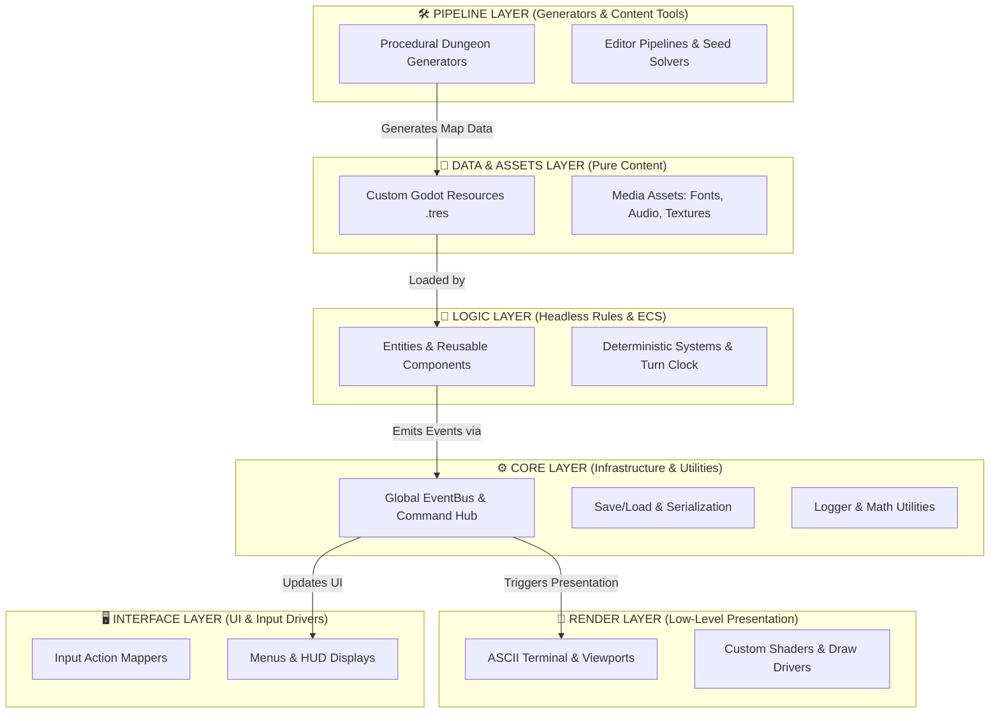

# Architectural Blueprint: ASCII Midnight Citadel Engine

This document outlines the core architecture for the **ASCII Midnight Citadel Engine** in Godot 4.7. The engine design enforces strict 6-tier separation of concerns, paired with decoupled event-driven communication and deterministic state management.

---

## 1. Core 6-Tier Architecture



### Key Architectural Tiers
1. **`core/` (Core Engine Services)**: Infrastructure utilities, global `EventBus`, save-state serialization, logging, and core math helpers.
2. **`assets/` & `data/` (Data & Media)**: Custom `.tres` resource scripts, JSON configs, fonts, textures, and audio. Contains NO execution logic.
3. **`logic/` (Gameplay Rules & Systems)**: Pure headless game logic, ECS components, turn order, and deterministic simulation algorithms.
4. **`render/` (Presentation & Graphics)**: Low-level rendering, ASCII terminal grid driver, shaders, and viewport management.
5. **`interface/` (UI & User Interaction)**: Input action mappers, menus, HUDs, and terminal UI controls.
6. **`pipeline/` (Generators & Tooling)**: Procedural map/dungeon generators, seed solvers, content creation tools, and build pipelines.

---

## 2. Directory Structure

```
ascii-midnight-citadel-engine/
├── AGENTS.md                  # Project rules & GDScript 4.7 formatting instructions
├── project.godot
│
├── assets/                    # PURE MEDIA ASSETS (Fonts, Audio, Textures)
│   ├── audio/
│   ├── fonts/
│   └── textures/
│
├── core/                      # ENGINE INFRASTRUCTURE (EventBus, Serializer, Logger)
│   ├── event_bus.gd
│   ├── registry.gd
│   ├── serializer.gd
│   └── logger.gd
│
├── data/                      # PURE DATA DEFINITIONS (Custom .tres resources & presets)
│   ├── presets/
│   └── resources/
│
├── logic/                     # PURE GAME LOGIC (Headless-compatible ECS & Simulation)
│   ├── components/
│   ├── entities/
│   └── systems/
│
├── render/                    # LOW-LEVEL PRESENTATION (ASCII terminal, Viewports, Shaders)
│   ├── ascii/
│   ├── shaders/
│   └── viewport/
│
├── interface/                 # UI & USER INTERACTION (HUD, Menus, Input Drivers)
│   ├── hud/
│   ├── input/
│   └── menus/
│
├── pipeline/                  # GENERATORS & TOOLING (Dungeon Proc-Gen, Seed Solvers)
│   ├── proc_gen/
│   └── tools/
│
├── plugins/                   # Addons & Extensions (e.g. MCP Server)
├── test/                      # GUT 9.7.1 Automated Unit Tests
└── docs/                      # Technical Documentation & Specifications
```
