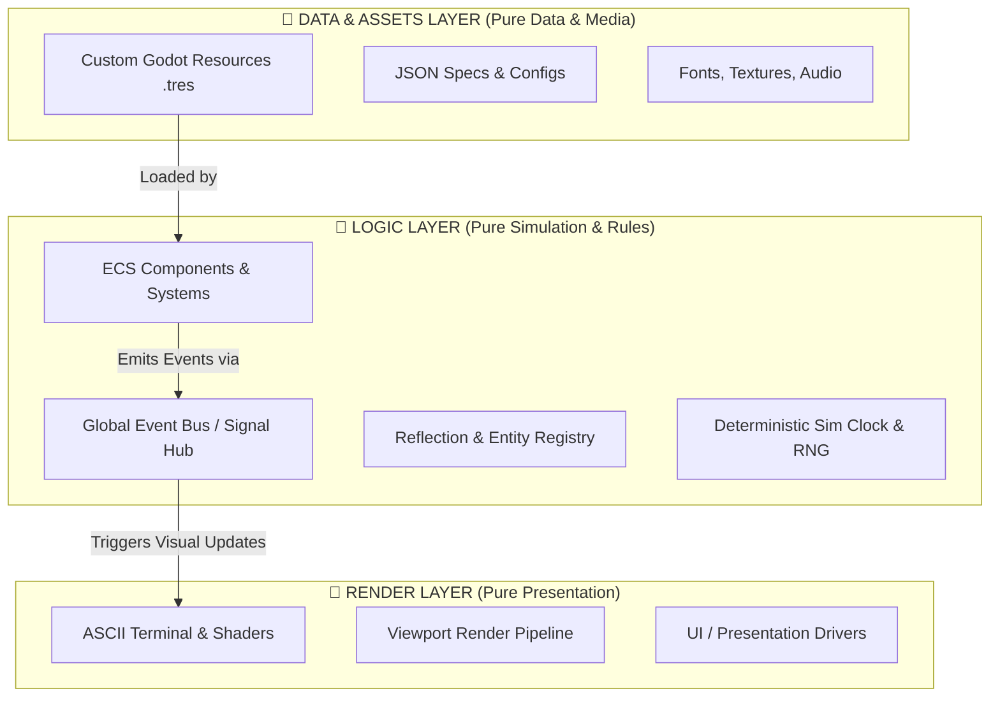

# Architectural Blueprint: ASCII Midnight Citadel Engine

This document outlines the core architecture for the **ASCII Midnight Citadel Engine** in Godot 4.7. The engine design enforces strict separation of concerns into **Assets & Data**, **Logic**, and **Render** layers, paired with decoupled event-driven communication and deterministic state management.

---

## 1. Core Architectural Separation



### Key Pillars
1. **Strict 3-Tier Separation**:
   - **Assets & Data (`assets/`, `data/`)**: Pure media, custom `.tres` resources, and JSON configs. Contains NO gameplay execution code.
   - **Logic (`logic/`)**: Headless game state, components, deterministic systems, and event processing. Completely independent of rendering.
   - **Render (`render/`)**: Presentation layer (ASCII shaders, terminal viewports, UI controls). Listens to `Logic` events to draw frames, but does not alter game rules directly.
2. **Decoupled (Event-Driven)**: Systems communicate solely through a typed **Global Event Bus & Command Dispatcher** (`logic/event_bus.gd`).
3. **Data-Driven**: Entities, abilities, items, and level rules are loaded from `Resource` (`.tres`) definitions without hardcoded constants.
4. **Reflective & Dynamic**: Capabilities are queried at runtime (`has_method()`, component traits) rather than hardcoded object hierarchies.
5. **Deterministic**: Simulation state updates via a seedable PRNG and fixed-step clock (`logic/systems/sim_clock.gd`), ensuring reproducible simulation, rewind, and replay.

---

## 2. Directory & Module Structure

```
ascii-midnight-citadel-engine/
├── AGENTS.md                  # Project rules & GDScript 4.7 formatting instructions
├── project.godot
│
├── assets/                    # PURE MEDIA ASSETS
│   ├── fonts/                 # Monospace & ASCII bitmap fonts
│   ├── textures/              # Sprites & tilesets
│   └── audio/                 # Sound effects & music
│
├── data/                      # PURE DATA & RESOURCE DEFINITIONS
│   ├── resources/             # Godot Resource scripts (ItemData.gd, EntityData.gd)
│   └── presets/               # Concrete .tres data instances
│
├── logic/                     # PURE GAME LOGIC (Headless Compatible)
│   ├── event_bus.gd           # Decoupled Global Signal Hub & Command Queue
│   ├── registry.gd            # Reflection & Dynamic Entity/Component Factory
│   ├── systems/               # Systems & Deterministic Clock
│   │   ├── sim_clock.gd
│   │   └── seeded_rng.gd
│   └── components/            # Reusable Entity Components
│       ├── base_component.gd
│       ├── health_component.gd
│       └── turn_component.gd
│
├── render/                    # PURE PRESENTATION & VISUALS
│   ├── ascii/                 # ASCII Grid Driver & Glyphs
│   ├── viewport/              # Viewport Management
│   └── shaders/               # ASCII Shader Pipelines
│
├── plugins/                   # Addons & Modular Extensions (e.g. MCP Server)
├── test/                      # GUT 9.7.1 Automated Unit Tests
└── docs/                      # Technical Documentation & Specifications
```

---

## 3. Detailed Component Specifications

### 3.1 Global Event Bus (`core/event_bus.gd`)
* Eliminates hard dependencies between systems.
* Supports **Publish-Subscribe** signals and **Command Dispatching** with optional event queuing for deterministic replay.

### 3.2 Dynamic Reflection Registry (`core/registry.gd`)
* Registers components, resource definitions, and plugin hooks at runtime.
* Allows query-by-trait (e.g., `Registry.get_entities_with(["HealthComponent", "ASCIIVisualComponent"])`).

### 3.3 Deterministic Engine Clock (`core/deterministic/sim_clock.gd`)
* Decouples rendering frame-rate from game simulation logic.
* Controls turn order or tick updates using deterministic seeds.

### 3.4 Reusable Component Pattern (`core/components/base_component.gd`)
* Lightweight Godot nodes attached to entities.
* Communicate via parent entity events or the central `EventBus`.

---

## 4. Next Implementation Steps & Decision Checklist

To proceed with building this engine step-by-step:

- [ ] **Step 1**: Scaffold core folders (`core/`, `data/`, `test/`, `plugins/`).
- [ ] **Step 2**: Implement the **Global Event Bus** (`core/event_bus.gd`) with unit tests in `test/test_event_bus.gd`.
- [ ] **Step 3**: Implement the **Deterministic Sim Clock & Seeded RNG** (`core/deterministic/`).
- [ ] **Step 4**: Implement the **Entity-Component & Reflection Registry** system.
