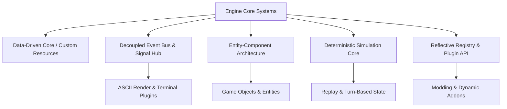

# Architectural Blueprint: ASCII Midnight Citadel Engine

This document outlines the core architecture for the **ASCII Midnight Citadel Engine** in Godot 4.7. The engine design prioritizes extreme decoupling, data-driven behavior, reflection-based reactivity, determinism, and plugin-based modularity.

---

## 1. Core Architectural Pillars



### Key Pillars
1. **Decoupled (Event-Driven)**: Nodes and systems never reference each other directly. All cross-system messaging passes through a typed **Global Event Bus & Command Dispatcher**.
2. **Data-Driven (No Hardcoding)**: All game stats, items, abilities, enemy behaviors, ASCII visual palettes, and level generation rules are defined in Godot `Resource` (`.tres`) files or JSON specifications.
3. **Reflective & Dynamic**: Systems query entity capabilities dynamically via reflection/interfaces (`has_method()`, custom metadata, and property registries) rather than concrete type casting.
4. **Deterministic**: State updates run through fixed-step update passes and seedable PRNGs (Pseudo-Random Number Generators), enabling rewind, replay, save-state serialization, and reproducible simulation.
5. **Component-Based (ECS / Modular Components)**: Entities are lightweight containers attached with reusable `Component` nodes (e.g., `HealthComponent`, `ASCIIVisualComponent`, `TurnActorComponent`).
6. **Plugin / Addon Based**: Features (terminal emulation, ASCII rendering, AI solvers, inventory systems) are modularized as Godot addons or internal engine plugins.

---

## 2. Directory & Module Structure Proposal

```
ascii-midnight-citadel-engine/
├── AGENTS.md                  # Project rules & GDScript 4.7 formatting instructions
├── project.godot
├── core/                      # Engine Core Subsystems
│   ├── event_bus.gd           # Decoupled Global Signal Hub & Command Queue
│   ├── registry.gd            # Reflection & Dynamic Factory Registry
│   ├── deterministic/         # Seeded RNG & Deterministic Fixed-Step Sim
│   │   ├── sim_clock.gd
│   │   └── seeded_rng.gd
│   └── components/            # Reusable Base Components
│       ├── base_component.gd
│       ├── health_component.gd
│       ├── ascii_render_component.gd
│       └── turn_component.gd
├── data/                      # Custom Resource Definitions & Data Definitions
│   ├── resources/             # Resource definitions (ItemData, EntityData, PaletteData)
│   └── presets/               # .tres Data Presets
├── plugins/                   # Engine Addons & Modular Extensions
│   ├── ascii_renderer/        # Modular ASCII Shader & Viewport Pipeline
│   └── mcp_server/            # AI MCP Interaction Server
├── test/                      # GUT 9.7.1 Automated Unit Tests
│   ├── test_event_bus.gd
│   ├── test_deterministic_sim.gd
│   └── test_components.gd
└── docs/                      # Engine Architecture Docs & Specifications
```

---

## 3. Detailed Component Specifications

### 3.1 Global Event Bus (`core/event_bus.gd`)
* Eliminates hard dependencies between systems.
* Supports **Publish-Subscribe** signals and **Command Dispatching** with optional event queuing for deterministic replay.

### 3.2 Dynamic Reflection Registry (`core/registry.gd`)
* Registers components, resource definitions, and plugin hooks at runtime.
* Allows query-by-trait (e.g., `Registry.get_entities_with(["HealthComponent", "ASCIIVisualComponent"])`).

### 3.3 Deterministic Engine Clock (`core/deterministic/sim_clock.gd`)
* Decouples rendering frame-rate from game simulation logic.
* Controls turn order or tick updates using deterministic seeds.

### 3.4 Reusable Component Pattern (`core/components/base_component.gd`)
* Lightweight Godot nodes attached to entities.
* Communicate via parent entity events or the central `EventBus`.

---

## 4. Next Implementation Steps & Decision Checklist

To proceed with building this engine step-by-step:

- [ ] **Step 1**: Scaffold core folders (`core/`, `data/`, `test/`, `plugins/`).
- [ ] **Step 2**: Implement the **Global Event Bus** (`core/event_bus.gd`) with unit tests in `test/test_event_bus.gd`.
- [ ] **Step 3**: Implement the **Deterministic Sim Clock & Seeded RNG** (`core/deterministic/`).
- [ ] **Step 4**: Implement the **Entity-Component & Reflection Registry** system.
